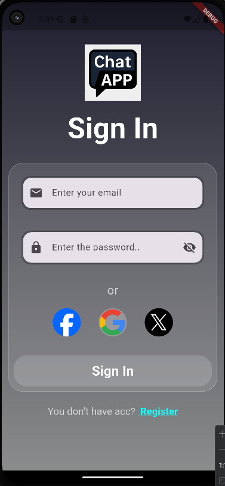
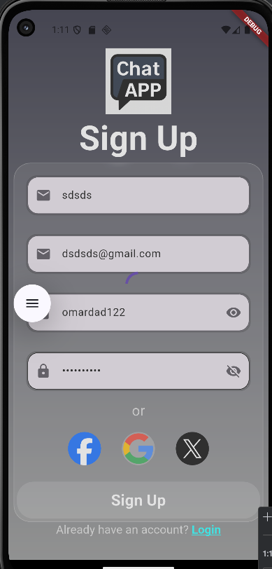
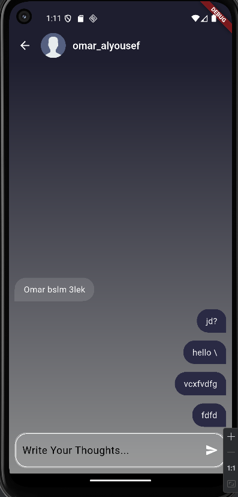
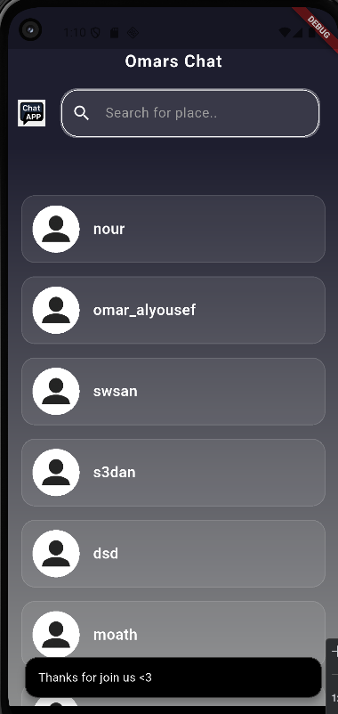

# Flutter Chat App (Educational Project)

This is a simple **Chat Application** built with **Flutter** and **Firebase**.  
It was created as a **learning project** to practice Firebase integration, user authentication, and real-time messaging with Firestore.

---

## 🚀 Features

- **User Authentication**  
  - Sign up with email and password.  
  - Sign in securely using FirebaseAuth.  

- **User Management**  
  - Display all registered users (from Firestore).  
  - Navigate to individual chat pages by selecting a user.  

- **Real-time Chat**  
  - Messages stored in **Firebase Firestore**.  
  - Messages displayed instantly with `StreamBuilder`.  
  - Supports message alignment (left/right) depending on the sender.  
  - Auto-scroll to the latest message.  

- **UI/UX**  
  - Custom reusable widgets:
    - `Textfield` → handles normal input and password fields (with show/hide toggle).
    - `CustomButton` → styled button used across the app.  
    - `ChatBubble` → displays chat messages with different alignment for sender/receiver.  
    - `TextChatField` → message input field with send action.  
    - `UserContainer` → shows user list in the users page.  
  - Gradient backgrounds and custom app styling.  
  - Snackbar notifications for errors and success messages.  

---

## 🛠️ Tech Stack

- **Flutter** (UI framework)
- **Firebase Authentication** (User login & signup)
- **Cloud Firestore** (Real-time chat storage)
- **ModalProgressHUD** (Loading overlay)
- **Custom Widgets** (for clean and reusable UI)

---

## 📂 Project Structure

lib/
│
├── main.dart # App entry point
├── firebase_options.dart # Firebase config
│
├── Screens/
│ ├── sign_in.dart # Sign in page
│ ├── sign_up.dart # Sign up page
│ ├── users_page.dart # Display users list
│ └── chat_page.dart # Chat screen
│
├── widgets/
│ ├── ChatBubble.dart # Chat message widget
│ ├── Textfield.dart # Custom text field (with password toggle)
│ ├── Text_chat_field.dart # Message input field with send button
│ ├── Custombutton.dart # Custom styled button
│ ├── mysnackbar.dart # Snackbar helper for errors/success
│ └── User_container.dart # User list item in Users page

3. Configure Firebase

Create a Firebase project from Firebase Console.

Enable Email/Password Authentication.

Add Cloud Firestore database.

Download your google-services.json and firebase_options.dart files.
This is a learning project, created to understand how Flutter works with Firebase.

The project demonstrates clean code practices by using custom widgets and basic state management.

You can extend the app with features like:

Profile pictures

Message deletion (unsend)

Push notifications

Typing indicators

## 📸 Screenshots

### 🔑 Sign In

### 📝 Sign Up

### 💬 Chats Page

### 👥 Users Page

